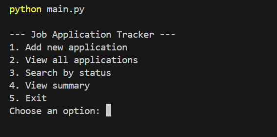
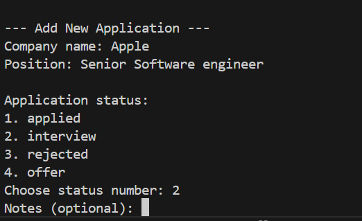
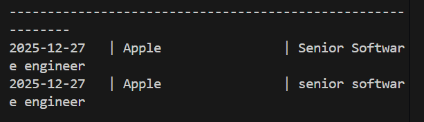
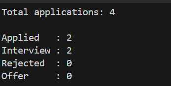

📄 Job Application Tracker (CLI)

A simple and practical Python command-line application for tracking job applications, their statuses, and related notes — all stored locally using CSV files.

This project is designed to mirror real-world job tracking while strengthening core Python and data-handling skills.

📌 What This Project Does

Records job applications with company name, role, status, and date

Stores data persistently in CSV format

Allows searching and filtering by application status

Provides summaries to track progress over time

🚀 Features

➕ Add new job applications

📋 View all saved applications

🔍 Search applications by status (Applied, Interview, Rejected, Offer)

📊 Summary of application statuses

🗂️ Automatic CSV header handling

✅ Input validation for cleaner data

🗂️ Application Statuses

Applied

Interview

Rejected

Offer

(Statuses are validated to avoid invalid entries)

🛠️ Technologies Used

Python

CSV file handling

Git & GitHub

Command-line interface (CLI)

▶️ How to Run the Project

Clone the repository:

git clone https://github.com/ashenafimohammed475-bot/job-application-tracker.git

Navigate to the project folder:

cd job-application-tracker

Run the application:

python main.py

## 📸 Screenshots

### Main Menu

### Add Application

### Search by Status

### Summary

Main Menu

Add Application

Search by Status

Summary View

🎯 Why This Project?

This project was built to practice and demonstrate:

File handling and persistent storage

Structured, function-based program design

Input validation and user-friendly CLI flows

Building tools that directly support real-life job searching

🔮 Future Improvements

Notes field for each application

Date-based filtering

CSV export for sharing

SQLite database support

Web or GUI version

👤 Author

Mohammed
Aspiring software developer focused on practical problem-solving, continuous learning, and building real-world tools.
